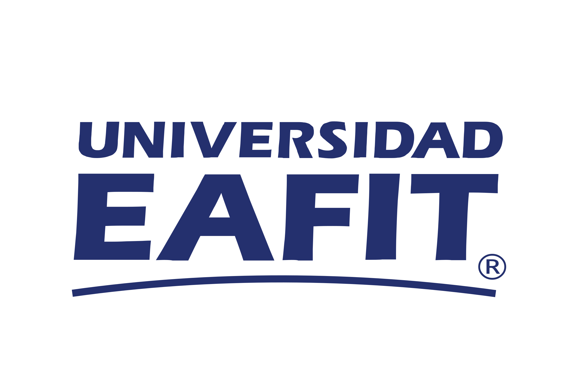

<!-- PROJECT LOGO -->
 

  

  <h3 align="center">Informe de actividades</h3>

  

    Informe de actividades realizadas en el primer año de vinculación a la Escuela de Ciencias Aplicadas e Ingeniería de la Universidad EAFIT   
    Juan David Martínez Vargas
  

## Tabla de contenidos
- [Informe de actividades](./informe.html)  
- [Plan quinquenal](./plan.html)  
